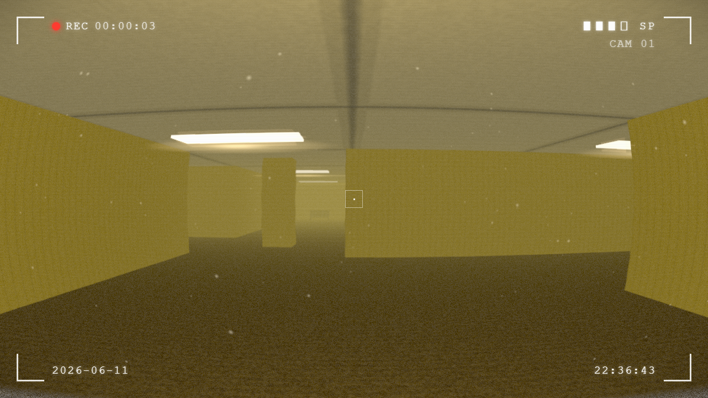
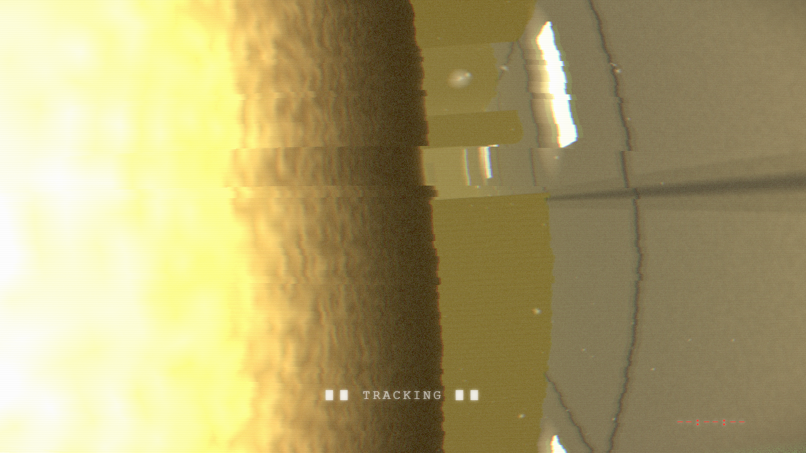
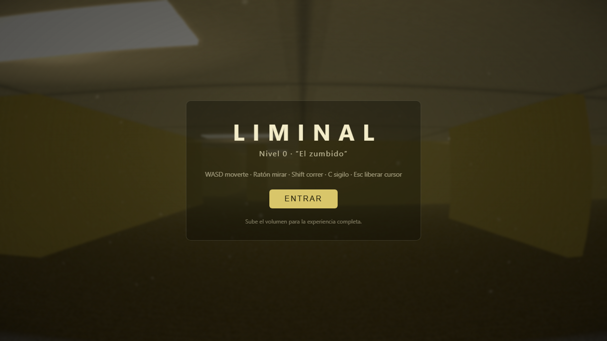

# LIMINAL

> Nivel 0: *"El zumbido"*

**Liminal** es un juego de terror en primera persona inspirado en los **Backrooms**: un edificio de oficinas infinito, reimaginado mil veces hasta perder todo sentido, bañado en una luz fluorescente amarilla enferma y el zumbido eterno de los fluorescentes. Eres un intruso en un lugar que no debería existir... y algo ya sabe que estás aquí.

🎮 **Juega ahora:** **[aangell98.github.io/liminal](https://aangell98.github.io/liminal/)**

> 🔊 Usa auriculares y sube el volumen: el audio es posicional y buena parte de la tensión está en lo que *oyes* antes de ver.



---

## El corazón del proyecto: la IA de la Entidad

> El valor de Liminal no es solo el juego, sino la **inteligencia artificial** que lo habita. La Entidad no sigue un script: razona sobre dónde estás, qué oye, qué ve y cuándo atacar.

Inspirada en el diseño de **Alien: Isolation**, la Entidad está gobernada por **dos mentes que trabajan a la vez**:

### 1. El Director (omnisciente)

Una IA de alto nivel que **siempre sabe dónde estás**, pero que *nunca* mueve a la criatura directamente. Su trabajo es dosificar la tensión:

- Acumula una variable de **amenaza** (`menace`) que sube cuanto más cerca estás y cuanto más tiempo sobrevives.
- Mantiene una **curva de fatalidad** (`dread`) que solo crece durante la partida: marca un suelo de amenaza que ya no baja, de modo que el final se vuelve inevitable.
- Le pasa a la criatura una *pista de objetivo* hacia tu zona, para que tarde o temprano te la encuentres de frente, sin venir en línea recta hacia ti como un misil teledirigido.
- Decide los momentos de **calma** (`lull`): la criatura "pierde tu rastro" a propósito para que el dread se reconstruya, y la siguiente oleada dé más miedo.

### 2. La Criatura (sensorial)

El cuerpo que recorre los pasillos. **Solo conoce lo que puede percibir**, con un modelo realista de sentidos:

- **Vista** limitada por la niebla (~18 m) y por la línea de visión real (raycast contra paredes).
- **Oído** dinámico: correr te delata a ~30 m, caminar a media distancia, el **sigilo** apenas a ~7 m. Tu nivel de ruido alimenta su radio de escucha.
- **Pathfinding A\*** sobre la rejilla del edificio, con **repathing** controlado por temporizador (nunca cada frame, para evitar tirones).
- **Flanqueo predictivo**: cuando no te ve, calcula hacia dónde *te diriges* (tu velocidad suavizada) y corta el paso para aparecer en la siguiente esquina.

### Una máquina de estados que *acecha*, no que persigue

La criatura no es un perseguidor plano. Vive en una FSM con personalidad:

`wander` → `investigate` → `stalk` (approach · peek · retreat) → `chase` → `search`

- Cuando te detecta no ataca: **acecha**. Se acerca a cubierto, te observa desde detrás de una columna (`peek`), se envalentona (`boldness`) y vuelve a retirarse, construyendo audacia en cada pasada.
- Si la **miras fijamente**, cede: se desliza lentamente hacia la oscuridad. Solo huye de verdad cuando le quitas la vista de encima.
- Cuando amenaza + audacia se desbordan, **se compromete** (`commit`) y lanza la persecución real.

### Poderes "paranormales" con reglas

Para que asuste sin hacer trampas baratas, la Entidad **solo se teletransporta cuando no la estás observando y hacia un punto sin línea de visión** (con una pared de por medio). Nunca aparece de la nada al girar la cámara: la encuentras al doblar una esquina. Cooldowns y periodos de calma evitan el abuso.

### Presencia diegética

Su sola cercanía **corrompe la realidad** antes de que la veas: la señal de la cinta se degrada, una presencia de subgraves crece, y los **fluorescentes a su alrededor parpadean y chisporrotean** violentamente, avisando por dónde viene. Lo *sientes* antes de verla.

> **Premisa de diseño:** eres un intruso, la Entidad es la dueña del mundo. No vas a escapar; el sigilo y las anomalías solo **retrasan** lo inevitable.



## La experiencia

- **Estética found-footage.** Cámara retro con marco de grabación, indicador `REC`, fecha/hora, grano, distorsión de lente ojo de pez y aberración cromática. Pareces estar viendo una cinta encontrada.
- **Backrooms fieles al lore.** Pasillos sin sentido, estancias que no conectan, paredes amarillas brillantes, moqueta húmeda y oscura, columnas y geometría imposible. Claustrofóbico a propósito.
- **Anomalías.** El mundo glitchea: apagones, pasos imposibles que giran a tu alrededor, susurros, temblores lejanos.
- **Audio procedimental.** Todo el sonido (zumbido eléctrico, pisadas, respiración, risas distorsionadas) se genera en tiempo real con la Web Audio API. Sin samples.



## Controles

### Teclado y ratón

| Tecla | Acción |
|-------|--------|
| `WASD` | Moverte |
| `Ratón` | Mirar |
| `Shift` | Correr (haces ruido) |
| `C` | Sigilo (silencioso, lento) |
| `Esc` | Liberar el cursor |

### Móvil

El juego **detecta pantallas táctiles** y muestra controles en pantalla automáticamente: joystick analógico (izquierda) para moverte, arrastra en cualquier parte para mirar, y botones **CORRER** y **SIGILO** de tipo *toggle* (pulsa para activar/desactivar, así no tienes que mantenerlos y puedes mirar a la vez).

## Stack técnico

- **[React 19](https://react.dev/)** + **TypeScript** (modo estricto)
- **[React Three Fiber](https://r3f.docs.pmnd.rs/)** + **[Three.js](https://threejs.org/)** para el render 3D
- **[@react-three/drei](https://github.com/pmndrs/drei)** y **[postprocessing](https://github.com/pmndrs/postprocessing)** para los efectos de cámara
- **Web Audio API** para todo el sonido procedimental
- **IA propia** (Director + Criatura, FSM + A\*) en `src/game/Entity.tsx`, sin librerías de IA
- **[Vite](https://vite.dev/)** como bundler
- Despliegue continuo en **GitHub Pages** vía **GitHub Actions**

## Desarrollo local

```bash
npm install
npm run dev      # servidor de desarrollo en http://localhost:5173
npm run build    # build de producción en dist/
npm run preview  # sirve el build de producción localmente
npm run lint     # ESLint
```

## Despliegue

Cada `push` a `main` dispara el workflow de GitHub Actions (`.github/workflows/deploy.yml`), que compila el proyecto y lo publica en GitHub Pages automáticamente.

---

*Proyecto personal y sin ánimo de lucro, hecho por amor al género liminal/Backrooms.*
